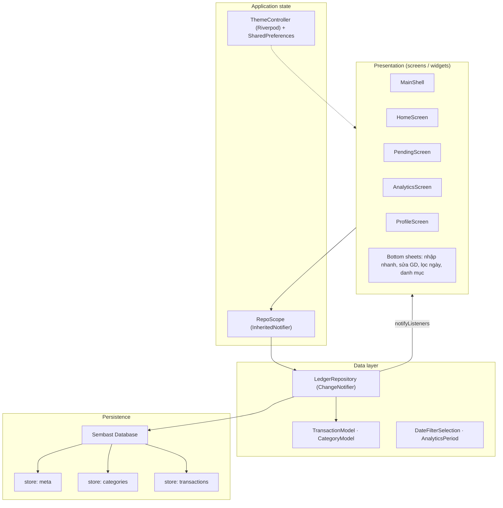
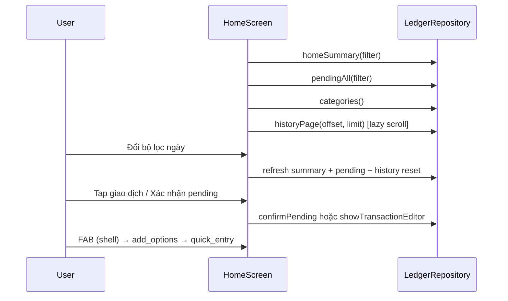
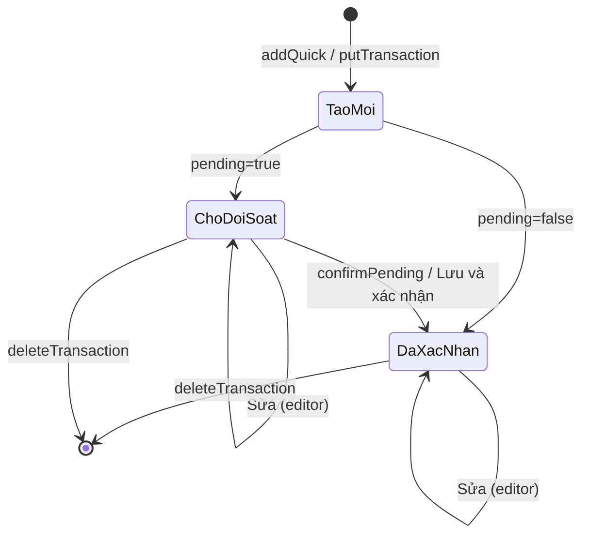

# Smart Ledger (`smart_expense`) — Nghiệp vụ & luồng dữ liệu

Tài liệu mô tả **toàn bộ nghiệp vụ hiện có** trong codebase Flutter `smart_expense` (offline-first, Android + PWA). Cập nhật theo mã nguồn tại thời điểm quét repo.

---

## 1. Tổng quan sản phẩm

| Mục | Mô tả |
|-----|--------|
| **Mục tiêu** | Ghi chi tiêu/thu nhập nhanh, xem tổng quan, đối soát giao dịch chưa đủ thông tin, báo cáo theo hạng mục |
| **Ngôn ngữ UI** | Tiếng Việt |
| **Tiền tệ** | VND — lưu `amountVnd` dạng **số nguyên** (không dùng float) |
| **Offline** | Toàn bộ dữ liệu giao dịch/danh mục trên thiết bị (Sembast); không có đồng bộ cloud |
| **Điều hướng** | 4 tab: Trang chủ · Đối soát · Báo cáo · Cá nhân |

---

## 2. Kiến trúc & luồng dữ liệu tổng thể



**Quy ước quan trọng**

- UI **không** gọi Sembast trực tiếp — mọi đọc/ghi qua `LedgerRepository`.
- `LedgerRepository` extends `ChangeNotifier`: sau mỗi thay đổi gọi `notifyListeners()` → màn hình đăng ký `repo.addListener(...)` tự reload.
- Theme tách riêng: `ThemeController` + `ThemeSettings` (SharedPreferences), không nằm trong DB giao dịch.

---

## 3. Khởi động ứng dụng

```
main()
  → initializeDateFormatting("vi")
  → SharedPreferences
  → AppDatabase.open()          // smart_expense.db (IO / Web)
  → LedgerRepository(db)
  → repo.ensureDefaults()
  → SmartExpenseRoot
```

### `ensureDefaults()` (`ledger_repository.dart`)

1. Nếu chưa có danh mục → `_seedCategories()` (12 hạng mục chi + 2 thu mặc định).
2. Luôn đảm bảo 2 hạng mục hệ thống **Khác**:
   - `system_khac_expense` (chi)
   - `system_khac_income` (thu)
3. Nếu chưa có meta `app` → `{ userName: "", onboarded: false }`.

### Điều hướng sau khởi động (`main.dart`)

| `meta.onboarded` | Màn hình |
|------------------|----------|
| `false` / null | `OnboardingScreen` (4 bước, nhập tên → `setOnboarded(true)`) |
| `true` | `MainShell` (4 tab) |

---

## 4. Mô hình dữ liệu

### 4.1 `TransactionModel` (`data/models/transaction_model.dart`)

| Trường | Kiểu | Nghiệp vụ |
|--------|------|-----------|
| `id` | `String` | UUID (key Sembast) |
| `title` | `String` | Tên hiển thị |
| `amountVnd` | `int` | Số tiền VND (≥ 0 khi lưu; validation ở UI) |
| `isIncome` | `bool` | `true` = thu, `false` = chi |
| `categoryId` | `String` | FK → `CategoryModel.id` |
| `occurredAt` | `DateTime` | **Ngày giao dịch** (lọc/báo cáo theo field này, không theo ngày tạo) |
| `pending` | `bool` | `true` = chờ đối soát (chưa vào lịch sử/tổng đã xác nhận) |
| `complete` | `bool` | Gợi ý “đủ thông tin để xác nhận một chạm” (amount + category) |
| `note` | `String?` | Ghi chú |
| `audio` | `Map?` | Metadata/reference audio local (`id`, `path`, `durationMs`, `createdAt`, `mimeType`, `extension`, `fileSize`) |
| `images` | `List<Map>` | Metadata/reference ảnh local (`id`, `path`, `mimeType`, `extension`, `fileSize`, `width`, `height`, `createdAt`) |

**Trạng thái giao dịch (logic nghiệp vụ)**

| pending | complete | Ý nghĩa thực tế |
|---------|----------|------------------|
| `true` | `false` | Thiếu thông tin (vd. amount=0, chưa chọn DM) |
| `true` | `true` | Đủ amount + danh mục → có thể **Xác nhận** một bước |
| `false` | `true` | Đã xác nhận → hiển thị trong **lịch sử** và tính **tổng thu/chi** |

`confirmPending(id)` → `pending: false`, `complete: true`.

### 4.2 `CategoryModel` (`data/models/category_model.dart`)

| Trường | Nghiệp vụ |
|--------|-----------|
| `id` | UUID hoặc ID cố định (hệ thống Khác) |
| `name` | Tên tiếng Việt |
| `iconKey` | Key trong `CategoryIcons.byName` |
| `colorValue` | ARGB cho UI |
| `isIncome` | Phân loại thu/chi |
| `enabled` | `false` → ẩn khỏi picker nhưng **giữ lịch sử**; UI hiển thị “Khác” |

### 4.3 Meta app (`store: meta`, record `app`)

| Key | Kiểu | Mục đích |
|-----|------|----------|
| `userName` | `String` | Tên người dùng (Cá nhân, onboarding) |
| `onboarded` | `bool` | Đã hoàn thành onboarding |

### 4.4 Cài đặt giao diện (`ThemeSettings` — SharedPreferences, không Sembast)

| Trường | Mặc định | Mục đích |
|--------|----------|----------|
| `seedColor` | `AppColors.brand` (#00544D) | Màu seed Material 3 |
| `themePreference` | `light` | `light` / `dark` / `system` |
| `enableAccentColors` | `false` | Bật mới cho chọn preset màu khác |
| `useColoredSurfaces` | `true` | Nền phối màu nhẹ theo seed |

`effectiveSeedColor` = brand khi `enableAccentColors == false`.

---

## 5. Lưu trữ Sembast

| Store | Key | Value |
|-------|-----|--------|
| `meta` | `"app"` | Map meta |
| `categories` | `categoryId` | `CategoryModel.toMap()` |
| `transactions` | `transactionId` | `TransactionModel.toMap()` |

**File:** `AppDatabase` — `sembast_io` (mobile/desktop), `sembast_web` (PWA), tên DB `smart_expense.db`.

---

## 6. `LedgerRepository` — API nghiệp vụ

### 6.1 Danh mục

| Method | Hành vi |
|--------|---------|
| `categories()` | Liệt kê, sort theo tên |
| `createCategory` / `upsertCategory` | Thêm/sửa |
| `deleteCategory` | Xóa record (UI chặn nếu `categoryInUse`) |
| `categoryInUse(id)` | Có giao dịch nào `categoryId == id`? |

### 6.2 Giao dịch

| Method | Hành vi |
|--------|---------|
| `allTransactions()` | Tất cả, sort `occurredAt` giảm dần |
| `putTransaction` / `deleteTransaction` | Ghi/xóa |
| `addQuick(...)` | Tạo `TransactionModel` mới + `putTransaction` |
| `clearAllTransactions()` | Xóa toàn bộ store transactions (demo) |
| `confirmPending(id)` | Bỏ cờ pending |

### 6.3 Lọc theo khoảng thời gian

Dùng `DateFilterSelection.resolveRange(now)` hoặc `AnalyticsPeriod.resolve(now)`.

**Điều kiện vào khoảng** (`_inRange`):

```text
occurredAt >= range.start AND occurredAt <= range.end
```

### 6.4 Trang chủ & đối soát

| Method | Logic |
|--------|--------|
| `homeSummary(filter)` | Trong khoảng, **`!pending`**: cộng `income` / `expense` theo `isIncome` |
| `pendingAll(filter)` | Trong khoảng, **`pending == true`**, sort mới nhất |
| `pendingForHome(filter)` | Giống `pendingAll` nhưng **`.take(3)`** (preview Trang chủ) |
| `historyPage(filter, offset, limit)` | Trong khoảng, **`!pending`**, phân trang (mặc định 20/lần) |

**Công thức tổng (đã xác nhận):**

```text
Thu nhập = Σ amountVnd  (isIncome && !pending)
Chi tiêu = Σ amountVnd  (!isIncome && !pending)
Số dư hiển thị (Báo cáo) = Thu − Chi
```

Giao dịch **pending không** được tính vào `homeSummary` và `analyticsTotals`.

### 6.5 Báo cáo

| Method | Logic |
|--------|--------|
| `analyticsTotals(period, custom?)` | Thu/chi trong kỳ, `!pending` |
| `categoryBreakdown(period, incomeSide, custom?)` | `Map<categoryId, sumAmount>` cho thu **hoặc** chi |
| `transactionsForCategory(...)` | Danh sách GD đã xác nhận theo DM + kỳ (drill-down biểu đồ) |

---

## 7. Bộ lọc thời gian

### 7.1 `DateFilterSelection` (Trang chủ, Đối soát)

| Preset | Khoảng |
|--------|--------|
| `last30Days` | 30 ngày gần nhất |
| `thisWeek` | Đầu tuần (T2) → now |
| `thisMonth` | Đầu tháng → now (**mặc định Trang chủ**) |
| `thisYear` | Đầu năm → now |
| `allTime` | 1970 → cuối năm sau |
| `pickMonth` / `pickYear` | Tháng/năm chọn |
| `custom` | `DateTimeRange` tùy chỉnh |

UI: `showDateFilterSheet` → cập nhật filter → gọi lại repo.

### 7.2 `AnalyticsPeriod` (Báo cáo)

| Kỳ | Khoảng |
|----|--------|
| `week` | Tuần hiện tại |
| `month` | Tháng hiện tại (**mặc định**) |
| `quarter` | Quý hiện tại |
| `year` | Năm hiện tại |
| `custom` | `showDateRangePicker` |

---

## 8. Luồng nghiệp vụ theo màn hình

### 8.1 Trang chủ (`home_screen.dart`)



- **Desktop:** 2 cột — trái: chờ đối soát; phải: lịch sử phân trang; header tùy chỉnh (không `SliverAppBar`).
- **Mobile:** `CustomScrollView` + summary cards + preview tối đa 3 pending + lịch sử.

### 8.2 Đối soát (`pending_screen.dart`)

- Cùng `DateFilterSelection` như Trang chủ.
- Liệt kê **toàn bộ** `pending` trong kỳ, nhóm theo ngày (`groupByDay`).
- Hành động: **Xác nhận** (`confirmPending` + confirm sheet), **Sửa** (`showTransactionEditor`).

### 8.3 Báo cáo (`analytics_screen.dart`)

- Tổng Thu / Chi / Chênh lệch theo kỳ.
- Toggle **Chi tiêu | Thu nhập** → donut `categoryBreakdown`.
- Chạm slice / hàng danh mục → bottom sheet `transactionsForCategory`.
- Chỉ giao dịch **`!pending`**.

### 8.4 Cá nhân (`profile_screen.dart`)

| Tính năng | Luồng dữ liệu |
|-----------|----------------|
| Tên người dùng | `setUserName` → meta |
| Giao diện | `ThemeController.update(ThemeSettings)` → SharedPreferences |
| Quản lý danh mục | `Navigator` → `CategoriesScreen` |
| Đối soát | `onOpenPending` → đổi tab shell |
| Thêm nhanh | `handleAddFab` |
| Demo Johny | `populateJohnyData` → `clearAllTransactions` + hàng loạt `addQuick` |

### 8.5 Quản lý danh mục (`categories_screen.dart`)

- Tách list **Chi tiêu** / **Thu nhập**.
- **Bật/tắt** (`enabled`) — không xóa dữ liệu lịch sử.
- **Không xóa/sửa** hạng mục hệ thống `system_khac_*`.
- Xóa: chỉ khi `!categoryInUse`.

### 8.6 Thêm giao dịch (FAB)

```
handleAddFab
  → Bottom sheet chọn mode
      ├── tap    → QuickEntryMode.tap
      ├── voice  → QuickEntryMode.voice
      └── receipt→ QuickEntryMode.receipt
  → showQuickEntrySheet
```

**`QuickEntryMode` — hành vi mặc định**

| Mode | `pending` ban đầu | Tự động |
|------|-------------------|---------|
| `tap` | `false` (user bật/tắt) | Nhập tay đầy đủ |
| `voice` | `true` | Auto title, amount=0, bắt đầu ghi âm |
| `receipt` | `true` | Auto title, amount=0, mở camera/gallery |

**Lưu (`_save`)**

- Title rỗng → mặc định “Chi tiêu nhanh” / “Thu nhập nhanh”.
- Nếu **không pending** → bắt buộc `amount > 0` và có danh mục.
- `complete` khi pending: `amount > 0 && categoryId != null`.
- Voice/receipt + nút xác nhận: có thể `confirm` → `pending = false` ngay.

### 8.7 Sửa / thêm đầy đủ (`transaction_editor_sheet.dart`)

- Dùng cho: sửa từ list, thêm từ profile, sửa pending.
- Validation:
  - Title không rỗng.
  - Nếu lưu/xác nhận không pending → `amount > 0`.
- Nút:
  - **Lưu & Xác nhận** → `confirm: true` → `pending = false`.
  - **Lưu** → giữ `pending` theo switch.
  - **Xoá** (chỉ khi `existing != null`).

### 8.8 Onboarding (`onboarding_screen.dart`)

4 trang giới thiệu → trang cuối nhập tên → `setUserName` + `setOnboarded(true)`.

### 8.9 Nhập nhanh qua bottom sheet (`quick_entry_sheet.dart`)

FAB → `add_options_sheet` → `showQuickEntrySheet` với `QuickEntryMode` (`tap` / `voice` / `receipt`). Form một trang: số tiền, danh mục, ngày, ghi chú, ảnh, ghi âm, cờ chờ xác nhận. Lưu qua `TransactionDraftResolver` + `repo.addQuick`.

---

## 9. Quy tắc hiển thị UI liên quan nghiệp vụ

| Quy tắc | Vị trí |
|---------|--------|
| Số tiền thu/chi | `MoneyText` — màu semantic `AppFinanceColors.incomeAmount` / `expenseAmount` (không phụ thuộc seed) |
| Danh mục bị tắt | `TxRow`: icon/text “Khác”, style muted |
| Pending actions | `buildPendingActions` — Xác nhận / Sửa |
| Nhóm theo ngày | `utils/tx_grouping.dart` → `TxDayHeader` |

---

## 10. Dữ liệu demo (`demo_seed.dart`)

`populateJohnyData(repo)`:

1. `clearAllTransactions()`
2. `setUserName("Johny Nguyễn")`
3. Dịch chuyển ngày seed để “hôm nay” luôn khớp runtime.
4. Thêm ~hàng trăm giao dịch qua `addQuick` (đa số `pending: false`).
5. ~10 giao dịch **pending** (audio/ảnh/quick) để demo đối soát.

---

## 11. Sơ đồ vòng đời một giao dịch



---

## 12. Danh mục mặc định (seed lần đầu)

**Chi tiêu (12):** Ăn uống, Tạp hoá, Mua sắm, Di chuyển, Hoá đơn, Giải trí, Sức khoẻ, Quà tặng, Làm đẹp, Công việc, Du lịch, Cà phê.

**Thu nhập (2):** Lương, Thu nhập khác.

**Hệ thống (luôn có):** Khác (chi), Khác (thu).

---

## 13. Phụ thuộc & giới hạn hiện tại

| Hạng mục | Ghi chú |
|----------|---------|
| Không có layer `domain/` tách repository interface | Logic nghiệp vụ nằm trong `LedgerRepository` + validation UI |
| Không budget / recurring / đa tài khoản | Chưa implement |
| Không đồng bộ đa thiết bị | Chỉ local DB |
| Ảnh/audio lưu base64 trong record | Có thể phình DB |
| `ThemeSettings` tách SharedPreferences | Không backup cùng Sembast |

---

## 14. File tham chiếu nhanh

| Nghiệp vụ | File chính |
|-----------|------------|
| Repository & tính tổng | `lib/data/ledger_repository.dart` |
| Model giao dịch | `lib/data/models/transaction_model.dart` |
| Model danh mục | `lib/data/models/category_model.dart` |
| Lọc ngày | `lib/data/date_filter.dart` |
| DB | `lib/data/app_database.dart` |
| Shell & FAB | `lib/screens/main_shell.dart`, `lib/widgets/add_options_sheet.dart` |
| Trang chủ | `lib/screens/home_screen.dart` |
| Đối soát | `lib/screens/pending_screen.dart` |
| Báo cáo | `lib/screens/analytics_screen.dart` |
| Cá nhân / theme | `lib/screens/profile_screen.dart`, `lib/core/theme_settings.dart` |
| Nhập nhanh | `lib/widgets/quick_entry_sheet.dart` |
| Sửa GD | `lib/widgets/transaction_editor_sheet.dart` |
| Demo | `lib/data/demo_seed.dart` |
| Khởi động | `lib/main.dart` |

---

*Tài liệu này mô tả hành vi **thực tế trong code**; khi đổi repository hoặc thêm use case, cập nhật file này cùng commit.*
